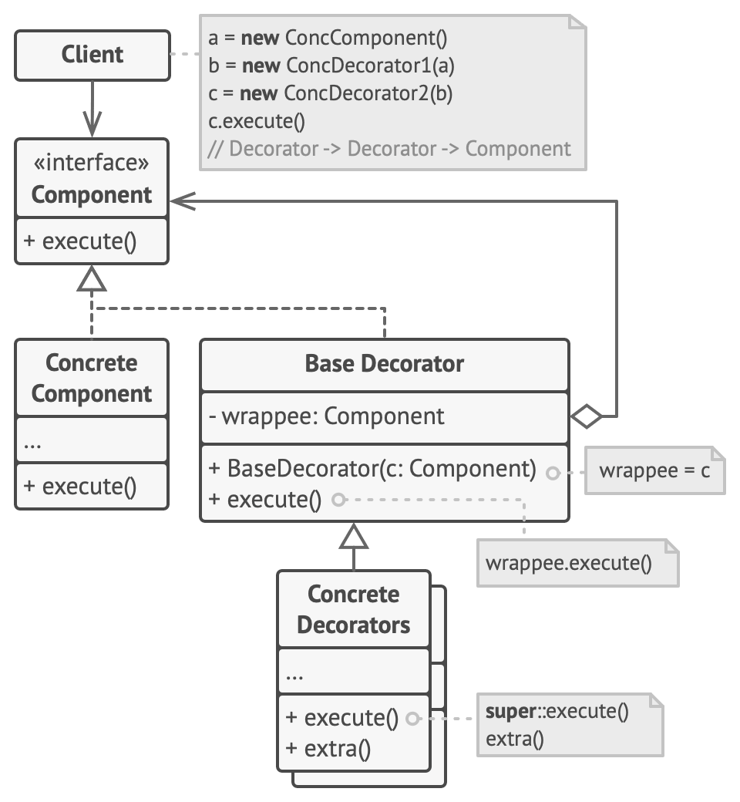
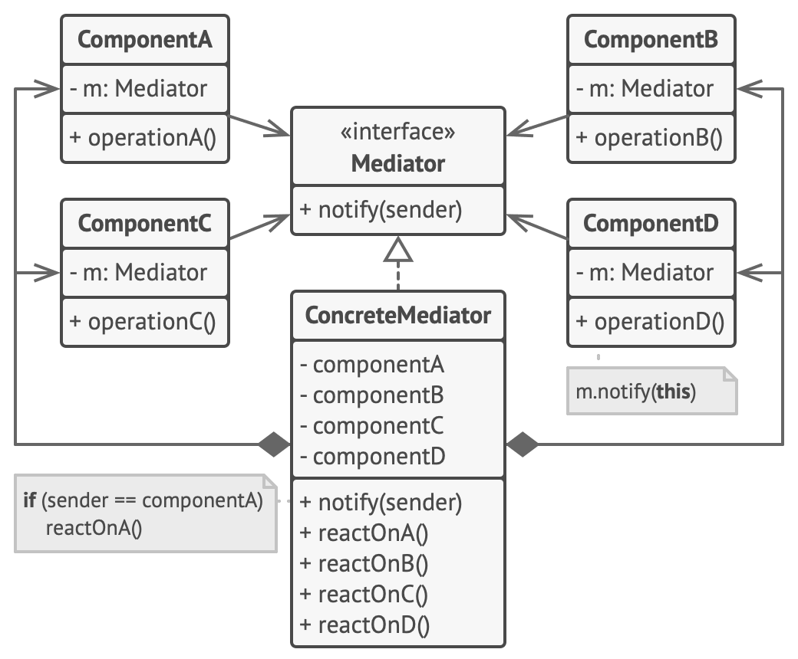

# DesignPatterns
Project with examples of design patterns.
  

## Creational Patterns
Design patterns that deal with object creation. 

### Abstract Factory

#### Definition
Abstract Factory is a pattern that creates related objects without specifying their concrete classes.

#### Usage
Use this pattern when you have related objects, but you don't want the application to depend on the concrete classes.

#### Pros
* The objects you’re getting from a factory will be compatible with each other
* Avoid tight coupling between concrete objects and the application
* Complies with the Single Responsibility Principle, because you can extract the object creation code into one place
* Complies with the Open/Closed Principle, because you can introduce new variants of objects without breaking the application  

#### Cons
* The code may become more complicated than it should be

### Factory Method

#### Definition
Factory Method is a pattern that provides an interface for creating objects in superclass,
but allows subclasses to alter the type of objects that will be created.

#### Usage
Use this pattern:
* When you don't know beforehand the exact types and dependencies of the objects your code should work with
* When you want to provide users of your library or framework with a way to extend its internal components
* When you want to save system resources by reusing existing objects instead of rebuilding them each time

#### Pros
* Avoid tight coupling between concrete objects and the application
* Complies with the Single Responsibility Principle, because you can move the object creation code into one place in the program
* Complies with the Open/Closed Principle, because you can introduce new types of objects into the program without breaking existing code

#### Cons
* The code may become more complicated than it should be

### Singleton

#### Definition
Singleton is a pattern that ensure that a class has only one instance, while providing a global access point to this instance.

#### Usage
Use this pattern:
* When a class in your program should have just a single instance available to all clients. Example: Database object
* When you need stricter control over global variables

#### Pros
* You can be sure a class has only a single instance
* You gain a global access point to that instance
* The singleton object is initialized only when it’s requested for the first time

#### Cons
* Violates the Single Responsibility Principle. Ensuring that a class has just a single instance and providing a global access point to that instance
* This pattern can mask bad design, for instance, when the components of the program know too much about each other
* The pattern requires special treatment in a multithreaded environment so that multiple threads won’t create a singleton object several times
* It may be difficult to create unit test of the Singleton

### Builder

#### Definition
Builder is a pattern that lets you construct complex objects step by step.

#### Usage
Use this pattern:
* When you need to construct composite objects
* When you want to get rid of a giant constructor

#### Pros
* You can create objects step-by-step
* You can reuse the same constructor to build objects
* Complies with the Single Responsibility Principle, because you can isolate complex construction code from the business logic

#### Cons
* The code may become more complicated than it should be

### Prototype

#### Definition
Prototype is a pattern that lets you copy existing objects without making your code dependent on their classes.

#### Usage
Use this pattern:
* When your code shouldn’t depend on the concrete classes of objects that you need to copy

#### Pros
* You can clone objects without coupling to their concrete classes
* You can get rid of repeated initialization code in favor of cloning pre-built prototypes
* You can produce complex objects more conveniently
* You get an alternative to inheritance when dealing with a configuration presets for complex objects

#### Cons
* Cloning complex objects that have circular references might be difficult to handle

## Structural Patterns
Design patterns that work as a blueprint of how different objects and classes are combined to form a bigger structure for achieving multiple goals altogether. 

### Adapter

#### Definition
Adapter is a pattern that allows objects with incompatible interfaces to collaborate.

#### Usage
Use this pattern:
* When you want to use some existing class, but its interface isn’t compatible with the rest of your code
* When you want to reuse several existing subclasses that lack some common functionality that can’t be added to the superclass

#### Pros
* Complies with the Single Responsibility Principle, because you can separate the interface or data conversion code from the primary business logic of the program
* Complies with the Open/Closed Principle, because you can introduce new types of adapters without breaking the existing client code

#### Cons
* The code may become more complicated than it should be

### Bridge

#### Definition
Bridge is a pattern that lets you split a large class, or a set of closely related classes into two separate hierarchies: abstraction (interface) and implementation (platform), which can be developed independently of each other.

#### Usage
Use this pattern:
* When you want to divide and organize a monolithic class that has several variants of some functionality
* When you need to be able to switch implementations at runtime

#### Pros
* You can create platform-independent classes and apps
* The client code works with high-level abstractions. It isn’t exposed to the platform details
* Complies with the Single Responsibility Principle, because you can focus on high-level logic in the abstraction and on platform details in the implementation
* Complies with the Open/Closed Principle, because you can introduce new abstractions and implementations independently of each other

#### Cons
* The code may become more complicated than it should be

### Composite

#### Definition
Composite is a pattern that lets you compose objects into tree structures and then work with these structures as if they were individual objects.

#### Usage
Use this pattern:
* When you have to implement a tree-like object structure
* When you want the client code to treat both simple and complex elements uniformly

#### Pros
* You can work with complex tree structures more conveniently: use polymorphism and recursion to your advantage
* Complies with the Open/Closed Principle, because you can introduce new element types into the app without breaking the existing code, which now works with the object tree

#### Cons
*  It might be difficult to provide a common interface for classes whose functionality differs too much. In certain scenarios, you’d need to overgeneralize the component interface, making it harder to comprehend

### Decorator

#### Definition
Decorator is a pattern that lets you attach new behaviors to objects by placing these objects inside special wrapper objects that contain the behaviors.

#### Usage
Use this pattern:
* When you need to be able to assign extra behaviors to objects at runtime without breaking the code that uses these objects
* When it’s awkward or not possible to extend an object’s behavior using inheritance

#### Pros
* You can extend an object’s behavior without making a new subclass
* You can add or remove responsibilities from an object at runtime
* You can combine several behaviors by wrapping an object into multiple decorators
* Complies with the Single Responsibility Principle, because you can divide a monolithic class that implements many possible variants of behavior into several smaller classes

#### Cons
* It’s hard to remove a specific wrapper from the wrappers stack
* It’s hard to implement a decorator in such a way that its behavior doesn't depend on the order in the decorators stack
* The initial configuration code of layers might look pretty ugly

### Facade

#### Definition
Facade is a pattern that provides a simplified interface to a library, a framework, or any other complex set of classes.

#### Usage
Use this pattern:
* When you need to have a limited but straightforward interface to a complex subsystem
* When you want to structure a subsystem into layers

#### Pros
* You can isolate your code from the complexity of a subsystem

#### Cons
* A facade can become a god object coupled to all classes of an app

### Flyweight

#### Definition
Flyweight is a pattern that lets you fit more objects into the available amount of RAM by sharing common parts of state between multiple objects instead of keeping all the data in each object.

#### Usage
Use this pattern:
* Only when your program must support a huge number of objects which barely fit into available RAM

#### Pros
* You can save lots of RAM, assuming your program has tons of similar objects

#### Cons
* You might be trading RAM over CPU cycles when some context data needs to be recalculated each time somebody calls a flyweight method
* The code may become more complicated than it should be

### Proxy

#### Definition
Proxy is a pattern that lets you provide a substitute or placeholder for another object, controlling access to the original object. Allowing you to perform something either before or after the request gets through to the original object.

#### Usage
Use this pattern:
* Lazy initialization (**Virtual Proxy**). This is when you have a heavyweight service object that wastes system resources by being always up, even though you only need it from time to time
* Access control (**Protection Proxy**). This is when you want only specific clients to be able to use the service object; for instance, when your objects are crucial parts of an operating system and clients are various launched applications (including malicious ones)
* Local execution of a remote service (**Remote Proxy**). This is when the service object is located on a remote server
* Logging requests (**Logging Proxy**). This is when you want to keep a history of requests to the service object
* Caching request results (**Caching Proxy**). This is when you need to cache results of client requests and manage the life cycle of this cache, especially if results are quite large
* Smart reference. This is when you need to be able to dismiss a heavyweight object once there are no clients that use it

#### Pros
* You can control the service object without clients knowing about it
* You can manage the lifecycle of the service object when clients don’t care about it
* The proxy works even if the service object isn’t ready or is not available
* Complies with the Open/Closed Principle, because you can introduce new proxies without changing the service or clients

#### Cons
* The response from the service might get delayed
* The code may become more complicated than it should be

## Behavioral Patterns
Patterns that are concerned with algorithms and the assignment of responsibilities between objects.

### Chain of Responsibility

#### Definition
Chain of Responsibility is a pattern that lets you pass requests along a chain of handlers. Upon receiving a request, each handler decides either to process the request or to pass it to the next handler in the chain.

#### Usage
Use this pattern:
* When your program is expected to process different kinds of requests in various ways, but the exact types of requests and their sequences are unknown beforehand
* When it’s essential to execute several handlers in a particular order
* When the set of handlers and their order are supposed to change at runtime

#### Pros
* You can control the order of request handling
* Complies with the Single Responsibility Principle, because you can decouple classes that invoke operations from classes that perform operations
* Complies with the Open/Closed Principle, because you can introduce new handlers into the app without breaking the existing client code

#### Cons
* Some requests may end up unhandled

### Command

#### Definition
Command is a pattern that turns a request into a stand-alone object that contains all information about the request. This transformation lets you pass requests as a method arguments, delay or queue a request’s execution, and support undoable operations.

#### Usage
Use this pattern:
* When you want to parametrize objects with operations
* When you want to queue operations, schedule their execution, or execute them remotely
* When you want to implement reversible operations

#### Pros
* You can implement undo/redo
* You can implement deferred execution of operations
* You can assemble a set of simple commands into a complex one
* Complies with the Single Responsibility Principle, because you can decouple classes that invoke operations from classes that perform these operations
* Complies with the Open/Closed Principle, because you can introduce new commands into the app without breaking existing client code

#### Cons
* The code may become more complicated than it should be

### Iterator

#### Definition
Iterator is a pattern that lets you traverse elements of a collection without exposing its underlying representation.

#### Usage
Use this pattern:
* When your collection has a complex data structure under the hood, but you want to hide its complexity from clients
* When you want to reduce duplication of the traversal code across your app
* When you want your code to be able to traverse different data structures or when types of these structures are unknown beforehand

#### Pros
* You can iterate over the same collection in parallel because each iterator object contains its own iteration state
* You can delay an iteration and continue it when needed
* Complies with the Single Responsibility Principle, because you can clean up the client code and the collections by extracting bulky traversal algorithms into separate classes
* Complies with the Open/Closed Principle, because you can implement new types of collections and iterators and pass them to existing code without breaking anything

#### Cons
* Applying the pattern can be an overkill if your app only works with simple collections
* Using an iterator may be less efficient than going through elements of some specialized collections directly

### Mediator

#### Definition
Mediator is a pattern that lets you reduce chaotic dependencies between objects. The pattern restricts direct communications between the objects and forces them to collaborate only via a mediator object.

#### Usage
Use this pattern:
* When it’s hard to change some of the classes because they are tightly coupled to a bunch of other classes
* When you can’t reuse a component in a different program because it’s too dependent on other components
* When you find yourself creating tons of component subclasses just to reuse some basic behavior in various contexts

#### Pros
* You can reduce coupling between various components of a program
* You can reuse individual components more easily
* Complies with the Single Responsibility Principle, because you can extract the communications between various components into a single place, making it easier to comprehend and maintain
* Complies with the Open/Closed Principle, because you can introduce new mediators without having to change the actual components

#### Cons
* Over time a mediator can evolve into a God Object
